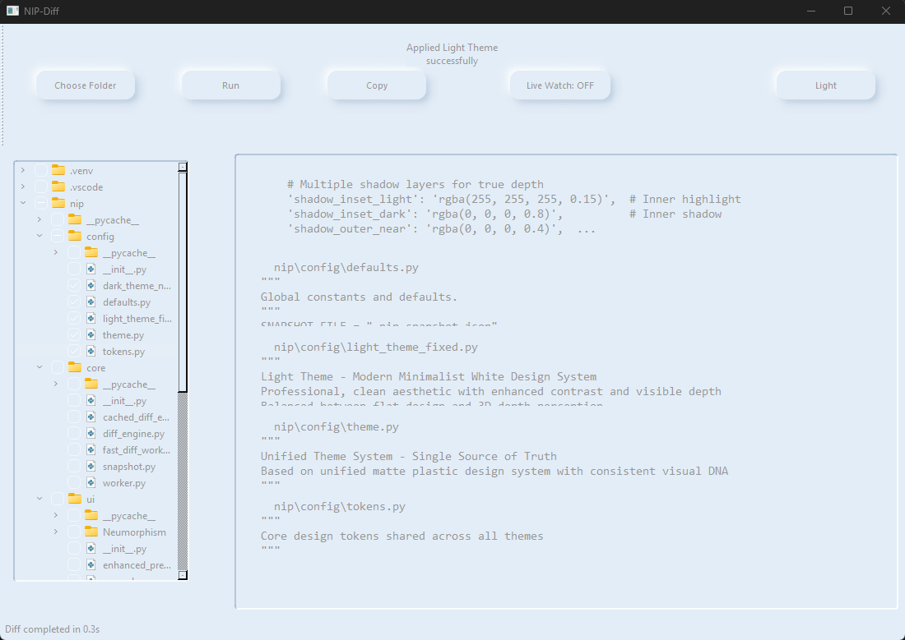
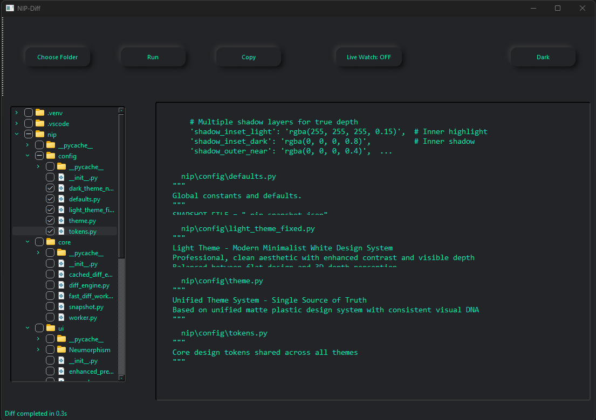

# Snip-Diff

```
███████╗███╗   ██╗██╗██████╗       ██████╗ ██╗███████╗███████╗
██╔════╝████╗  ██║██║██╔══██╗      ██╔══██╗██║██╔════╝██╔════╝
███████╗██╔██╗ ██║██║██████╔╝█████╗██║  ██║██║█████╗  █████╗  
╚════██║██║╚██╗██║██║██╔═══╝ ╚════╝██║  ██║██║██╔══╝  ██╔══╝  
███████║██║ ╚████║██║██║           ██████╔╝██║██║     ██║     
╚══════╝╚═╝  ╚═══╝╚═╝╚═╝           ╚═════╝ ╚═╝╚═╝     ╚═╝     
                                                              
    ⚡ Powers AI Workflows - No More Manual File Copying ⚡
```

**AI workflow tool for preparing code context outside agentic environments**


## Screenshots

### Light Theme


### Dark Theme  


## Mission

Snip-Diff bridges the gap between your codebase and AI language models. It aggregates multiple files into AI-ready formats with visual selection, unified diff generation, and one-click copying. Built for developers who need to efficiently provide code context to GPT, Claude, Gemini, and other LLMs.

## Features

**Core Functionality**
- Multi-file selection with visual tree interface
- Unified diff generation preserving file relationships
- Advanced syntax highlighting optimized for AI consumption
- One-click copy for seamless LLM integration
- Live file watching with automatic updates
- Fast cached diff engine with intelligent change detection

**Enhanced User Experience**
- **Interactive Instructions Panel** - Built-in guidance system with step-by-step instructions
- **Professional Neumorphic Design** - Sophisticated UI with custom shadows and smooth animations
- **Dual Theme Support** - Light and dark themes with seamless switching
- **Custom Scrollbars** - Elegant, theme-aware scrollbars that blend with the interface
- **Responsive Layout** - Professional file tree with proper selection feedback

**Developer Features**
- Robust caching system for performance optimization
- Error handling and status reporting
- Extensible architecture with modular components
- Cross-platform compatibility (Windows, macOS, Linux)

## Installation

```bash
git clone https://github.com/tayyab3245/snip-diff.git
cd snip-diff
python -m venv venv
source venv/bin/activate  # Windows: venv\Scripts\activate
pip install -r requirements.txt
python main.py
```

**Requirements:** Python 3.9+, PySide6, Pygments

## Usage

**Quick Start**
1. **Open Project** - Launch app and select your project folder (Ctrl+O)
2. **Follow Instructions** - Use the built-in instructions panel for guided setup
3. **Select Files** - Choose relevant files from the file tree
4. **Generate Context** - Create optimized diff output 
5. **Copy & Use** - One-click copy (Ctrl+C) and paste into your favorite LLM
6. **Add instructions** - Append custom instructions on top or bottom of your prompt

**Pro Tips**
- Use theme switching (Ctrl+T) for optimal viewing in different environments
- The instructions panel provides real-time guidance for complex workflows
- Custom scrollbars and neumorphic design enhance long coding sessions
- File selection state is preserved between sessions for consistent workflows

## Upcoming Updates

**Smart Token Management** (In Development)
- **Platform-specific Token Limits** - Automatic optimization for GPT-4, Claude, Gemini, and other LLMs
- **Intelligent File Tokenizing** - Advanced algorithms to chunk large codebases efficiently
- **Context Size Optimization** - Smart splitting to maximize information density within token limits
- **Export Presets** - One-click exports tailored for different AI providers and use cases

**Intelligence Features** (Planned)
- **File Relevance Scoring** - AI-powered prioritization of most important files for context
- **Smart Change Detection** - Focus on meaningful changes while filtering noise
- **Dependency Graph Analysis** - Understand file relationships for better context inclusion
- **Integration Hub** - Direct connections with popular AI coding assistants and IDEs

**Advanced Workflow Features** (Planned)
- **Project Templates** - Pre-configured setups for common frameworks and languages
- **Collaborative Context Sharing** - Team-friendly context sharing and versioning
- **Advanced Search & Filter** - Regex support, content-based filtering, and smart suggestions
- **Performance Analytics** - Track context effectiveness and optimization suggestions

---

**Copyright © 2025 Tayyab. All Rights Reserved.**

*This software is proprietary and confidential. Built for the AI development community with professional-grade features and design.*
